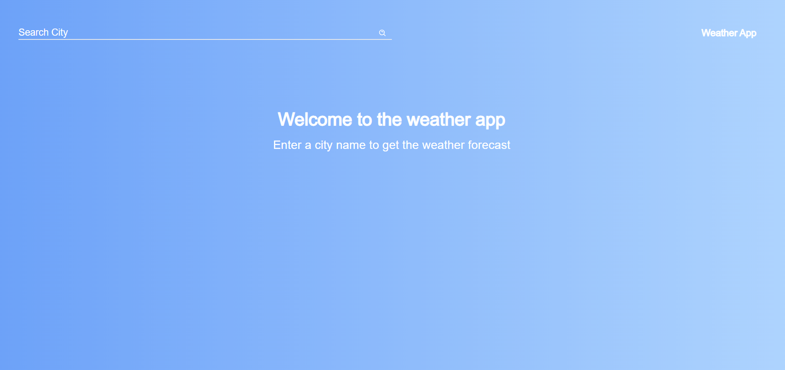
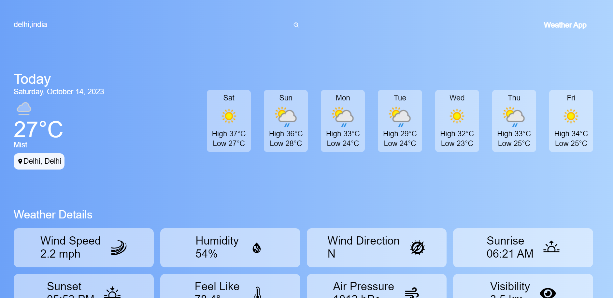

Weather App
Table of Contents
Introduction
Key Features
Technologies Used
Setup Instructions
Usage
Screenshots
Contributing
Contact

Introduction
Welcome to the Weather App repository! This ReactJS-based app provides comprehensive weather information, including the current weather, 7-day forecast, and detailed weather data such as humidity, sunrise, sunset, and air pressure. Stay informed about the weather conditions wherever you are.

Key Features
Current Weather: Display real-time weather information for the current location or a specified location.
7-Day Forecast: View a 7-day weather forecast to plan ahead.
Detailed Weather Data:
Humidity
Sunrise time
Sunset time
Air pressure
Technologies Used
Frontend:

ReactJS
HTML
CSS
JavaScript
APIs: weatherapi

Weather API for current weather and forecast data
[weatherapi]
Setup Instructions
Follow these steps to set up the Weather App locally:

Clone the repository to your local machine using git clone [repository URL].
Navigate to the project directory: cd weather-app.
Install dependencies using npm install.
Start the development server: npm start.
Open the app in your web browser at http://localhost:3000.
Usage
To use the Weather App:

Open the app in a web browser.
Allow the app to access your location or enter a specific location.
Explore the current weather, 7-day forecast, and detailed weather data.
Screenshots

Contributing
We welcome contributions from the community! If you'd like to contribute to the Weather App, please follow the Contribution Guidelines and Code of Conduct.

Contact
For inquiries or assistance, please contact us at swetasingh03052000@gmail.com.